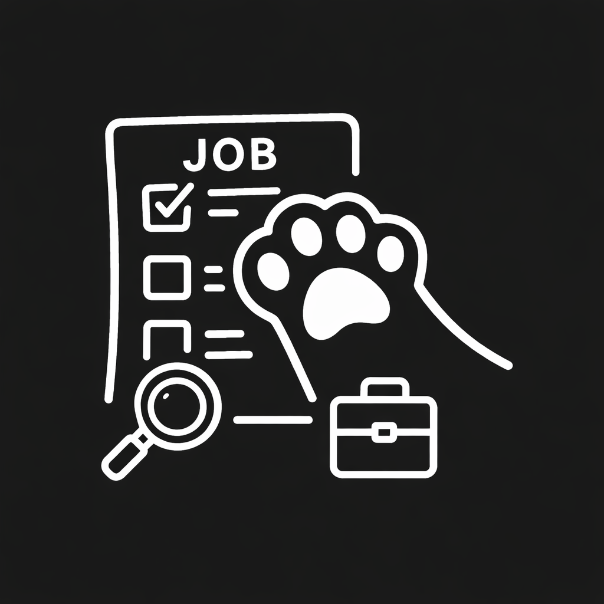
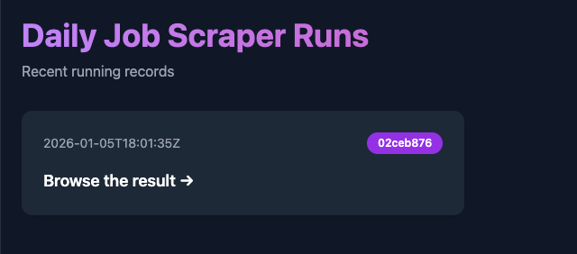
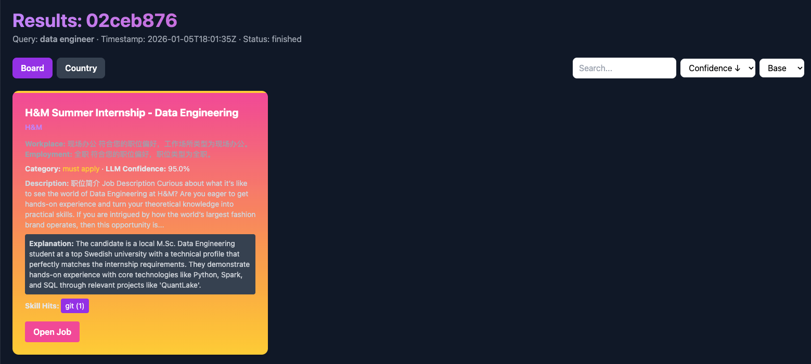
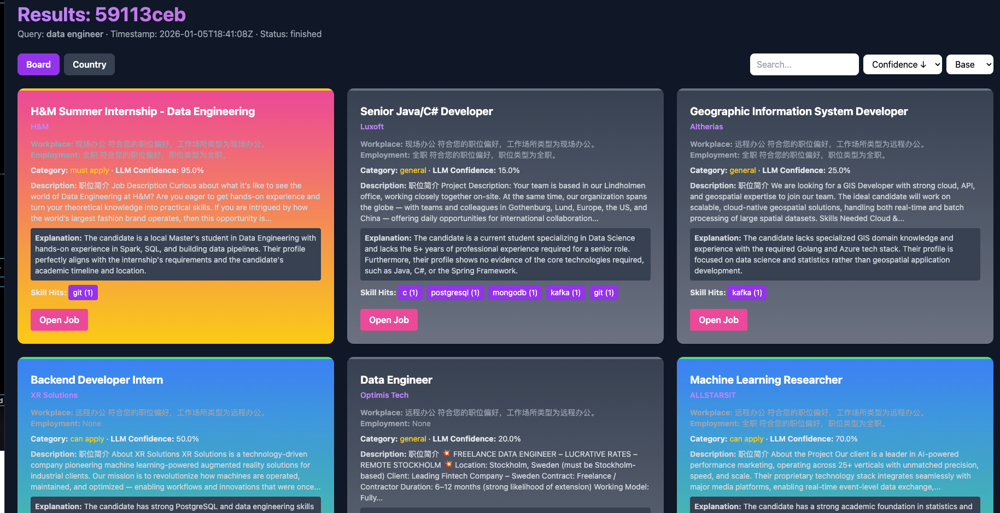

# pawMYjob
<p align="center">
  
</p>

pawMYjob is a local, privacy-first job discovery and recommendation system that scrapes new LinkedIn job postings in selected European countries, scores and explains fit between a candidate (resume.md) and each job using embeddings + an LLM (Gemini), and presents results in a clean two-page UI (pipeline status + job results). The project is designed to run entirely locally (Airflow scheduler + a worker process) and ships with a small launcher to help users bootstrap configuration (API keys, resume upload) and run the system.

---
## Features

+ Upload a single resume.md containing experience, education, projects and an explicit skills section.

+ Daily scraping of LinkedIn job search pages for selected countries (Sweden, Denmark, Norway, Finland, Germany). Playwright-based crawler used for robust page rendering.

+ Ranking & explanation:
    +Embedding-based semantic similarity (sentence-transformers).

    + LLM (Gemini) used to produce a human-readable confidence (0–100), short explanation, and a label: must apply, recommended, can apply, general.

    +Final score is a calibrated mix of embedding and LLM outputs.

+ UI:
  + Status page showing daily Airflow runs and run status.

  + Result page with three visualization modes: table, board (cards per role), and country (cards grouped by country).

  + Job card contents: title, work percentage (full-time/part-time if present), posted date, deadline (if present), job link, AI confidence, short job description text, and LLM explanation.

+ Local-first: all data and keys are stored locally. No external storage required.

+ Safe operation: the system discovers and recommends jobs only — it does not automatically submit applications.

<div>
<p align="center">
  
</p>
<p align="center">
  
</p>
<p align="center">
  
</p>
</div>

## Architecture
```bash
[Airflow scheduler]               # airflow_env
        |
     triggers
        |
[Worker process (LangGraph)] -----> [Playwright crawler]  (scrape & extract job links)
        |                           [Firecrawl optional MCP/REST]
        |
   [Matcher: embeddings + Gemini LLM]
        |
   persist results -> stored_data/runs/*.json
        |
[Flask frontend]  (status & results) -> http://localhost:8000
```

+ Airflow: schedule & orchestration (runs daily at configured time; calls worker Python in a separate venv).

+ Worker: contains scraping, matching, and renderer logic (separate virtualenv to avoid dependency conflicts with Airflow).

+ Frontend: minimal Flask + Jinja templates (two pages).

+ Launcher (optional): small local web form to provide resume.md and API keys and to start the worker + frontend.

## Quick start (developer / local)
`These are minimal instructions for a developer machine (macOS/Linux). Replace paths as necessary.`

### Prerequisites

+ Python 3.10+ (or compatible)

+ Git

+ Playwright browsers (if using Playwright crawler)
  
### Example .env
```makefile
LANGCHAIN_API_KEY = AAAAAAAAAAAAAA
```

### Install & run (recommended flow)

```bash
# Airflow env (only scheduler/orchestrator)
python3 -m venv airflow_env/.venv
source airflow_env/.venv/bin/activate
pip install -r airflow_env/requirements.txt
deactivate

# Worker env (scraper, embeddings, LLM, frontend)
python3 -m venv worker_env/.venv
source worker_env/.venv/bin/activate
pip install -r worker_env/requirements.txt

# If using Playwright:
pip install playwright
playwright install
deactivate

```

## Install & Run (Recommended Flow)

This project uses **two isolated virtual environments** to avoid dependency conflicts
between Airflow and LLM / scraping workloads.

---

### 1. Create virtual environments

#### 1.1 Airflow environment (scheduler only)

```bash
python3 -m venv airflow_env/.venv
source airflow_env/.venv/bin/activate

pip install -r airflow_env/requirements.txt

deactivate
```

---

#### 1.2 Worker environment (scraping + LLM + frontend)

```bash
python3 -m venv worker_env/.venv
source worker_env/.venv/bin/activate

pip install -r worker_env/requirements.txt
```

If Playwright is used:

```bash
pip install playwright
playwright install
```

---

### 2. Prepare resume and environment variables

#### 2.1 Resume file

Place your resume at:

```text
worker_env/stored_data/resume.md
```

Recommended structure (example):

```markdown
## Experience
...

## Education
...

## Projects
...

## Skills
- Python
- Data Engineering
- Airflow
- SQL
- Spark,hive,flink
- Cloud Platforms
```

The **Skills** section will be heavily used for matching and LLM evaluation.

---

#### 2.2 Environment variables

Create a `.env` file under `worker_env/`:

```env
LLM_PROVIDER=gemini
GEMINI_API_KEY=your_gemini_api_key_here
FIRECRAWL_API_KEY=your_firecrawl_api_key_here
OPENAI_API_KEY=
```

Note: `.env` should NOT be committed to Git.

---

### 3. Run worker pipeline manually (single run)

```bash
source worker_env/.venv/bin/activate

python -m worker_env.src.langgraph_flow \
  --resume worker_env/stored_data/resume.md \
  --query "data engineer"

deactivate
```

This will:

- Scrape LinkedIn job postings
- Match jobs against your resume
- Call LLM to compute confidence scores and labels
- Generate structured JSON results

---

### 4. Start frontend server

```bash
source worker_env/.venv/bin/activate

export FLASK_APP=worker_env.src.app
flask run --port 8000
```

Open in browser:

```text
http://localhost:8000
```

---

### 5. Enable Airflow scheduling (optional)

DAG file location:

```text
airflow_env/dags/daily_job_scraper.py
```

Typical DAG task command:

```bash
/full/path/to/worker_env/.venv/bin/python \
  -m worker_env.src.langgraph_flow \
  --resume /full/path/to/worker_env/stored_data/resume.md \
  --query "data engineer"
```

Start Airflow:

```bash
source airflow_env/.venv/bin/activate

airflow db init
airflow webserver -p 8080
airflow scheduler
```

Airflow UI:

```text
http://localhost:8080
```

## How matching & scoring works (concise)

1. Candidate profile extraction — parse_md.py extracts raw text and a skills list (prefer last Skills markdown section).

2. Embedding similarity — job description + title are embedded and compared to the resume using sentence-transformers; this gives a normalized embedding score.

3. LLM evaluation — Gemini (configured via GEMINI_API_KEY or LLM client) is prompted to give a JSON containing:

    + confidence (0–100)

    + label (must apply / recommended / can apply / general)

    + explanation (1–3 sentence rationale)

4. Final score — LLM confidence (if available) is combined with embedding score for stability (configurable weights; default is 70% LLM, 30% embedding).

5. Output — each job JSON contains embed_score, final_score, category, llm.explanation, evaluated_at. Renderer builds cards and tables for UI.

## Data & privacy / compliance

+ This project only discovers and recommends jobs. It does not submit applications automatically.

+ Respect LinkedIn's terms of service and robots.txt. Use the Playwright crawler responsibly (rate-limiting and retries are implemented).

+ Keep API keys and resume files local — do not commit them to Git.

## Troubleshooting (common issues)

+ Airflow install fails: Airflow has many system dependencies. If local installation is difficult, run Airflow in Docker or use a lightweight scheduler (cron) for dev.

+ Playwright not rendering: Ensure you ran playwright install after installing the package.

+ LLM errors: Verify GEMINI_API_KEY or other LLM credentials and network access. The matcher falls back to embedding-based scoring if LLM is not available.

+ Dependencies conflict between Airflow and worker: keep airflow_env and worker_env virtualenvs separate. The DAG should invoke worker Python as a subprocess.

## Development notes & extension ideas

+ Add user authentication for multi-user deployments (local-first design can be extended).

+ Add export options: CSV / JSON / One-click copy of application text.

+ Add more sophisticated resume parsing (structured extraction of years, titles, company names).

+ Add a small review / annotation UI so a user can accept/reject suggestions and feed that back into fine-tuning.

## Contributing

+ Fork the repository.

+ Create a feature branch.

+ Open a pull request with a clear description of changes.

+ Please keep secrets out of commits. Use .env or the launcher to provide keys.

## Contact / Credits

+ Project: pawMYjob

+ Built with: Playwright (crawler), sentence-transformers (embeddings), Gemini (LLM), Airflow (scheduler), LangChain (llm workflow orchestration), Flask (UI).